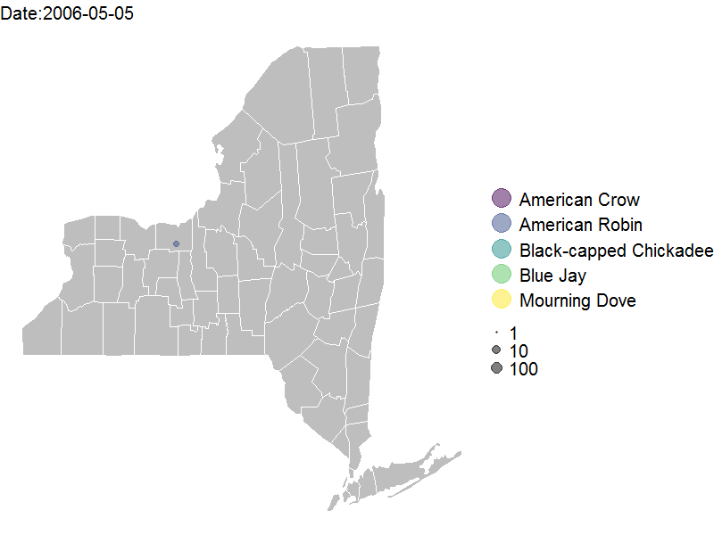

This presentation shows the work done to analyze the Ebird dataset, which was provided in the BIOL 580V course.

First, I will load the required packages.

```{r,setup,warning=FALSE}
library(here)
library(ggplot2)
library(tidyverse)
library(maps)
library(gganimate)
library(gifski)
library(viridis)

knitr::opts_chunk$set(warning=FALSE)
```
--

Next I will load data. Disabled quoting to avoid a warning regarding quoted string.

```{r,load-data}
data<-read.csv(here("data/ebird.csv"),header=FALSE,sep="\t", quote="")

data<-data%>%
    separate(col=V2,into=c("Date_1","Time_1"),sep=' ')

```

---

## Data cleaning and preparation
The file contains information about the Ebird Project.

```{r,assessing data}
head(data)
```

The dataset contains many columns that we might not be interested in. For example, the first column is an identifier, some columns are empty, and others have people's names in it. We are interested in the Common Name, Genus, Species Count, Location Name, Latitude, Longitude and observation date. We will first assign names to the columns we are interested in and then we will remove all other columns.

---

**Since there are no headers in this dataset, I will assume that the 9th column of the original dataset (which has been renamed as Species_Count) contains the number of observations for each species.** 

Next, we will set the "Date" column with a date format. And finally, we will make the "Species_Count" column numeric, which will automatically change all the "X" (which I am assuming are missing observations) to _NA_.

--

```{r, column names}
data_clean<-data %>%
    rename(Common_name=V5,
           Genus=V6, 
           Species_Count=V9,
           Country=V13,
           Latitude=V26,
           State=V15,
           County=V17,
           Longitude=V27,
           Date_2=V28,
           Start_time=V29, 
           Type_obseration=V34)%>%
    select(-contains("V"))

data_clean$Date_1<-as.Date(data_clean$Date_1)
data_clean$Species_Count<-as.numeric(data_clean$Species_Count)
```
---

## Data exploration

Where are these observations being made? And how  many different species of birds there are in the dataset?

```{r,location}
Country<-unique(data_clean$Country)
Country

State<-unique(data_clean$State)
State

all_species<-length(unique(data_clean$Genus))
all_species
```

--

All observations are done within the state of NY! But there are 408 different species of birds. Visualizing such high number would be too complicated. For the scope of this project, I will choose the 5 species with the highest number of counts in the dataset. 

---

First, I will make sure that no _NAs_ are included in the count (I believe this is already being taken care of by {dyplr} but better safe than sorry). Next, I will group the data by _Genus_, and count the number of occurrences of each Genus. Then, I will order the observations in descending order and finally, I will pick the top ten rows.

```{r, most-common-species}
top_species<-na.omit(data_clean) %>%
    group_by(Genus) %>%
    summarize(Count=n()) %>%
    arrange(desc(Count)) %>%
    slice_head(n=5)
   
top_species
```

--

This result makes sense, the most common bird found in the dataset is the American Crow, followed by the Black-capped chickadee and the American robin, among others. Finally, I will save the top 10 species as a new dataset.

---

```{r,top_species_data}
top_species_data<-na.omit(subset(data_clean,data_clean$Genus==top_species$Genus))
top_species_data$Genus<-as.factor(top_species_data$Genus)
```

Now the coordinate data will be plotted over the state of NY.

---
## Plotting the data

First we need to create a map of NY, which will be created using the {ggplot} and {maps} libraries. 

```{r,plotting, eval=FALSE}

US_map<-map_data("county","New York")
ny_map<-ggplot(data=US_map,
               mapping=aes(x=long,
                           y=lat,group=group)
               )+geom_polygon(color="black",
                              fill="gray")+
    geom_polygon(data=US_map,fill=NA,color="white")+
    theme_void()

```

---

Now we add on top the bird observations. I will make an animation using the package `gganimate` to see how bird sightings change over time for the top 5 species. The size of each point will be proportional to the count of species in order to better visualize the changes over time.

```{r,animation, eval=FALSE}
#animation 
bird_map_2<-ny_map+
    geom_point(data= top_species_data,
               inherit.aes = FALSE,
               aes(x=Longitude,
                   y=Latitude,
                   col=Common_name,
                   size=Species_Count
                   ),
                alpha=0.5
    )+
    scale_size(trans="log10")+
    scale_color_viridis_d()+
    guides(colour = guide_legend(override.aes = list(size=10)))+
    theme(legend.text=element_text(size=20),
          legend.title=element_blank(),
          plot.title=element_text(size=20))+
    transition_time(top_species_data$Date_1)+
    labs(title="Date:{frame_time}")+
    ease_aes('linear')+
    enter_appear()+
    exit_disappear()

anim<-animate(bird_map_2,fps=1, duration=60, height=600, width=800)
anim_save("ebird_updated.gif",anim)
```

---

## The animation

The result is this animation, which shows how bird sightings have been recorded for crows, bluejays, robins, Black-capped Chickadees and Mourning doves.


