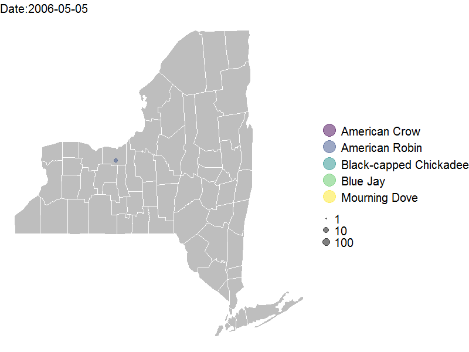

name: about-me
layout: false
class: about-me-slide, inverse, middle, center

# Ebird Data Exploration
### Ariel Mundo

.blue[BIOL 580V <br> <br>
Department of Biomedical Engineering<br>
University of Arkansas<br> Fayetteville, AR, USA
]
---
```{r,setup,warning=FALSE, include=FALSE}
options(htmltools.dir.version = FALSE)
library(here)
library(ggplot2)
library(tidyverse)
library(maps)
library(gganimate)
library(gifski)
library(viridis)

knitr::opts_chunk$set(
  fig.width=5, 
  fig.height=3, 
  fig.retina=3,
  #out.width = "50%",
  cache = FALSE,
  echo = TRUE,
  message = FALSE, 
  warning = FALSE,
  fig.show = TRUE,
  fig.showtext = TRUE,
  hiline = TRUE
)

xaringanExtra::use_panelset()
xaringanExtra::use_tile_view()
xaringanExtra::use_share_again()
xaringanExtra::style_share_again(
  share_buttons = c("twitter","linkedin")
)

```

## Introduction

This presentation shows the work done to analyze the Ebird dataset, which was provided in the BIOL 580V course.

These are the steps I took to analyze the data:

- Load libraries for plotting and data cleaning

- Data cleaning

- Quick analysis to decide direction of analysis

- Visualization

---
## Loading and cleaning the data

- Load data, the separator for the data was tab or "\t".
- The dataset contains many columns that we might not be interested in. I was interested in the Common Name, Genus, Species Count, Location Name, Latitude, Longitude and observation date.

.panelset[
.panel[.panel-name[Loading data]
```{r,load-data}
data<-read.csv(here("data/ebird.csv"),header=FALSE,sep="\t", quote="")

data<-data%>%
    separate(col=V2,into=c("Date_1","Time_1"),sep=' ')

```
]

.panel[.panel-name[Dataset head]

```{r,assessing-data}
head(data,n =3)
```
]
]

---
## Data Cleaning

.green[Since there are no headers in this dataset, I assumed that the 9th column of the original dataset (which has been renamed as Species_Count) contains the number of observations for each species.]

- I set the "Date" column with a date format, and make "Species_Count" column numeric.

```{r, column names, include=FALSE}
data_clean<-data %>%
    rename(Common_name=V5,
           Genus=V6, 
           Species_Count=V9,
           Country=V13,
           Latitude=V26,
           State=V15,
           County=V17,
           Longitude=V27,
           Date_2=V28,
           Start_time=V29, 
           Type_obseration=V34)%>%
    select(-contains("V"))

data_clean$Date_1<-as.Date(data_clean$Date_1)
data_clean$Species_Count<-as.numeric(data_clean$Species_Count)
```

--

- Where are these observations being made? And how  many different species of birds there are in the dataset?

.panelset[
.panel[.panel-name[Country]
```{r,country}
Country<-unique(data_clean$Country)
Country

```
]

.panel[.panel-name[State]
```{r,state}
State<-unique(data_clean$State)
State
```
]
.panel[.panel-name[Number of species]
```{r,Number-of-species}
all_species<-length(unique(data_clean$Genus))
all_species
```
]
]

---
## Quick data exploration

- All observations are done within the state of NY, 408 different species
- I chose 5 species with the highest number of counts in the dataset. 

I grouped the data by _Genus_, and counted the number of occurrences. Then, picked the top 5 rows.The most common bird found in the dataset is the American Crow.

--
.panelset[
.panel[.panel-name[Results]
```{r, top-species, echo=FALSE}
top_species<-na.omit(data_clean) %>%
    group_by(Genus) %>%
    summarize(Count=n()) %>%
    arrange(desc(Count)) %>%
    slice_head(n=5)
   
top_species
```
]
]

```{r,top_species_data, include=FALSE}
top_species_data<-na.omit(subset(data_clean,data_clean$Genus==top_species$Genus))
top_species_data$Genus<-as.factor(top_species_data$Genus)
```

---
## Plotting the data

.pull-left[
- I decided to plot the count per each type of bird using the {ggplot} and {maps} packages.

- Later, animated using the  {gganimate} package to see how bird sightings change over time.

- The result is this animation: bird sightings have been recorded for crows, bluejays, robins, Black-capped Chickadees and Mourning doves.
]

.pull-right[]

```{r,plotting, eval=FALSE, include=FALSE}

US_map<-map_data("county","New York")
ny_map<-ggplot(data=US_map,
               mapping=aes(x=long,
                           y=lat,group=group)
               )+geom_polygon(color="black",
                              fill="gray")+
    geom_polygon(data=US_map,fill=NA,color="white")+
    theme_void()

```


```{r,animation, eval=FALSE, include=FALSE}
#animation 
bird_map_2<-ny_map+
    geom_point(data= top_species_data,
               inherit.aes = FALSE,
               aes(x=Longitude,
                   y=Latitude,
                   col=Common_name,
                   size=Species_Count
                   ),
                alpha=0.5
    )+
    scale_size(trans="log10")+
    scale_color_viridis_d()+
    guides(colour = guide_legend(override.aes = list(size=10)))+
    theme(legend.text=element_text(size=20),
          legend.title=element_blank(),
          plot.title=element_text(size=20))+
    transition_time(top_species_data$Date_1)+
    labs(title="Date:{frame_time}")+
    ease_aes('linear')+
    enter_appear()+
    exit_disappear()

anim<-animate(bird_map_2,fps=1, duration=60, height=600, width=800)
anim_save("ebird_updated.gif",anim)
```

---

## Future work

- I would like to include more species in the analysis

- Also implement  a 3-D map animation that shows where birds are being sighted with the inclusion of terrain data.
